# macro-dashboard

A trading terminal that consolidates macro data, options positioning, sector rotation, calendars, and insider activity into one place.

**[Try free at the-macro-dashboard.com](https://the-macro-dashboard.com)**

---

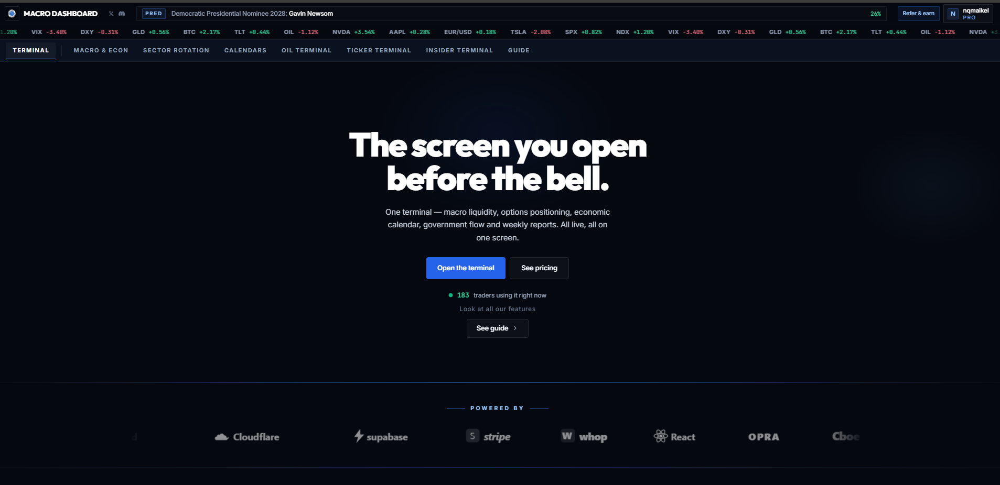

---

## Macro & Econ

Central bank liquidity, yield dynamics, and macro regime intelligence across four sub-sections: Economy & Rates, Risk & Sentiment, Global Matrix, and Seasonals.

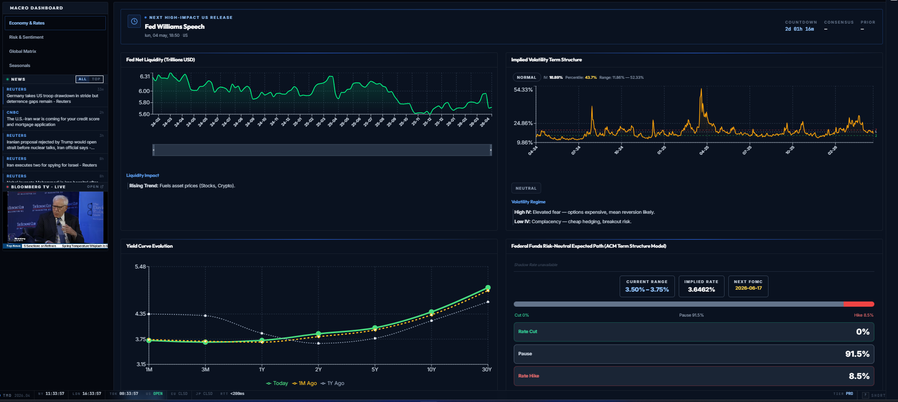

**Economy & Rates**

- **Fed Net Liquidity** — Fed Balance Sheet minus TGA minus RRP. Tracks each component separately with a net liquidity trend and impact signal.
- **Implied Volatility Term Structure** — IV percentile and historical range across maturities. Regime label (Normal / Elevated / Stressed) and contango/backwardation status.
- **Yield Curve Evolution** — Full term structure 1M through 30Y with today, 1 month ago, and 1 year ago overlays. Inversion alert included.
- **Fed Funds Risk-Neutral Path** — Market-implied rate trajectory with per-meeting cut/pause/hike probabilities and next FOMC date.

**Risk & Sentiment**

- **Risk Composite** — Score (0–100) combining VIX, VVIX, and Geopolitical Risk Index (GPR) into a single regime signal.
- **Social Search Concern** — Tracks fear-based search trends: Recession, Inflation, Mortgage Help. Threshold alert on elevated readings.
- **Corporate Credit Spread (OAS)** — Option-adjusted spread gauge with a semicircle meter. Leading indicator for corporate default risk.
- **Consumer Sentiment (UMich)** — University of Michigan confidence index with historical chart and trend direction.

**Global Matrix**

- **Global Economic Indicators** — Interactive cross-country comparison of GDP growth, CPI, and benchmark rates for G10 economies. Toggle Eurozone view and linear/log scale.

**Seasonals**

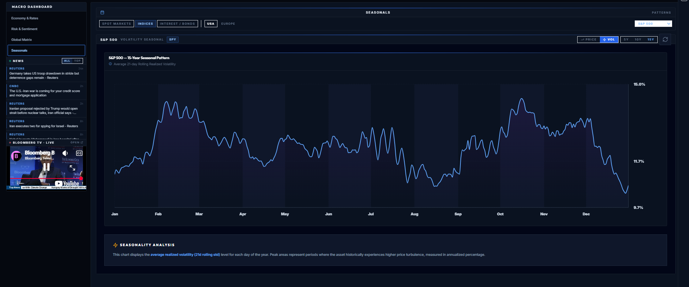

- **Seasonal Pattern Charts** — Average realized volatility and price seasonal maps over up to 15 years of history. 5Y / 10Y / 15Y lookback, price and volatility mode (21-day rolling std), covering spot markets, indices, interest rates, bonds, and European markets.

---

## Sector Rotation

Multi-signal sector flow scoring, rotation dynamics, and volatility positioning across all 11 GICS sectors.

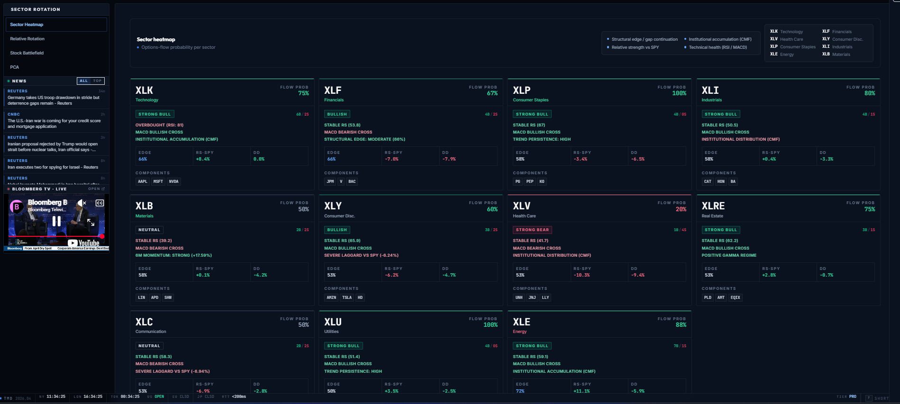

**Sector Heatmap**

Per-sector scoring grid updated live. Each sector shows flow probability, RS-SPY, drawdown, RSI, MACD signal, and CMF (accumulation/distribution). Regime classification from Strong Bull to Strong Bear. Flags structural edge/gap continuation, institutional accumulation, and relative strength vs SPY per sector.

**Relative Rotation Graph (RRG)**

Scatterplot of 11 sectors across Leading, Weakening, Lagging, and Improving quadrants relative to SPY. JdK RS-Ratio on the x-axis and JdK RS-Momentum on the y-axis with a 12-week rotation trail per sector.

**Stock Battlefield**

2D grid mapping IV Rank against Risk-Reversal. Four quadrants: Cheap/Expensive IV crossed with Bullish/Bearish directional bias. Toggle between watchlist and sector view.

**PCA**

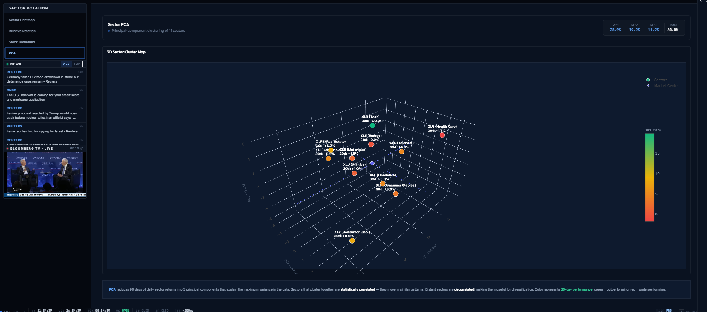

3D Sector Cluster Map using Principal Component Analysis of sector returns — PC1, PC2, PC3 with explained variance. Sectors that cluster together move in correlated patterns; distant sectors are useful for diversification. Color represents 30-day performance.

---

## Calendars

Economic events, earnings, options expiry cycles, and G6 central bank rate path expectations.

**Economic Calendar**

Full macro event calendar for the next 7 days with consensus estimates, prior readings, and impact scoring. Filterable by impact level (High / Medium / Low) and currency. Today-only or full-week toggle.

**Earnings Calendar**

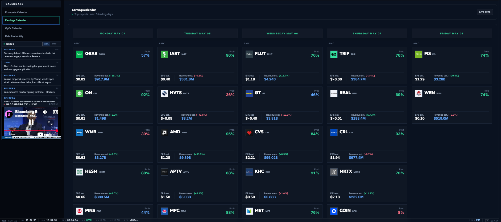

Top earnings reports for the next 5 trading days (Monday through Friday) with beat probability percentage, EPS estimate, and revenue estimate with percentage change. Live sync.

**OpEx Calendar**

Monthly, quarterly, and quad-witching options expiration dates with days remaining and post-OpEx SPY/QQQ price context.

**Rate Probability — G6 Central Banks**

Market-implied rate probabilities for Fed, ECB, BOE, BOJ, RBA, and BOC. Current target rate, hold/cut/hike bias, probability percentages, next meeting date, and rate path model decomposition separating expectations from term premia.

---

## Oil Terminal

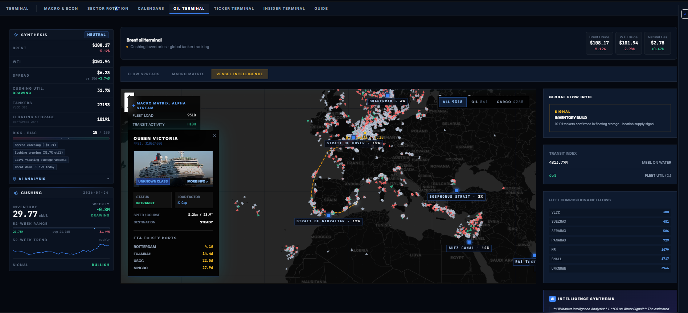

Institutional crude oil terminal. Left sidebar shows live synthesis signal, Cushing inventory, tanker count, and risk-bias score at all times.

**Flow Spreads**

Real-time Brent and WTI prices with 6-month spread history. Current spread, 30-day average, 6-month min/max, standard deviation, and delta vs 30-day average. Synthesis sidebar shows directional signal (Bullish / Bearish / Neutral), Cushing utilization percentage, VLCC count, floating storage, and risk-bias score 0–100.

**Macro Matrix**

Rolling correlation heatmap between crude, energy equities, natural gas, and the USD. Adjustable lookback window with strongest and weakest/inverse coupling lists.

**Vessel Intelligence**

Live global tanker map updated in real time. Click any vessel for MMSI, status, load factor, speed, destination, and ETA to key ports. Fleet load and transit activity (High / Normal / Low) as aggregate metrics. Chokepoint congestion shown for Strait of Dover, Gibraltar, Bosphorus, Suez Canal, and others. Global Flow Intel panel shows Transit Index (MBBL on water), fleet utilization, and fleet composition split across VLCC, Suezmax, Aframax, Panamax, MR, and small tankers.

---

## Ticker Terminal

Per-stock institutional intelligence: AI briefing, gamma walls, screener, options flow, strategy builder, and live GEX feed.

**Ticker Analyzer**

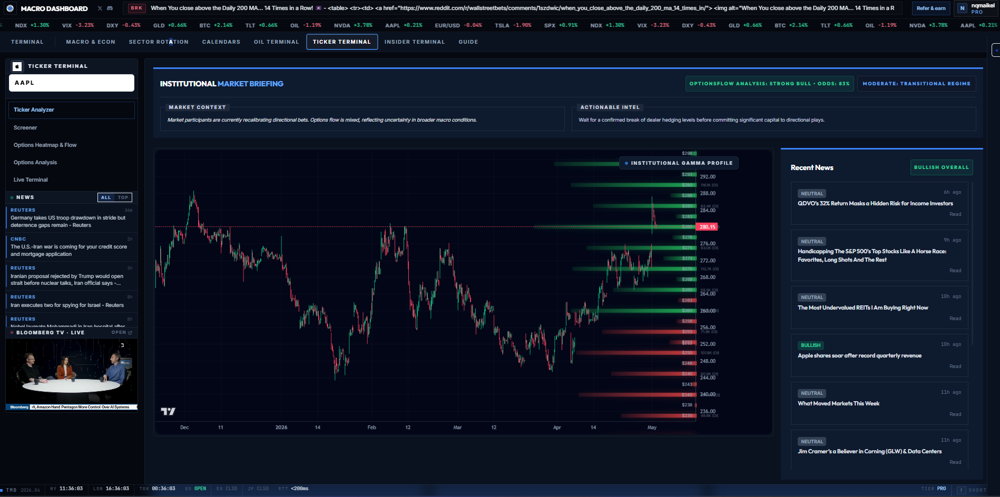

- **Institutional Market Briefing** — AI-generated market context and actionable intel for the active ticker. Shows OptionsFlow Analysis signal, bullish odds percentage, and regime label.
- **Gamma Profile Chart** — Candlestick with institutional gamma profile overlay — horizontal bars at key price levels showing open interest, call/put wall levels, and gamma flip level.
- **Recent News** — AI-tagged news feed with Bullish / Neutral / Bearish sentiment labels per headline.

**Screener**

- **Quick Scan** — Filter the full US equity universe by price, market cap, volume, P/E, and momentum.
- **Value + Options** — Fundamental filters (P/E, PEG, ROE, margins) combined with IV rank, put/call ratio, and options volume.
- **Results Table** — Sortable output with full market context. Save and reload filter presets.

**Options Heatmap & Flow**

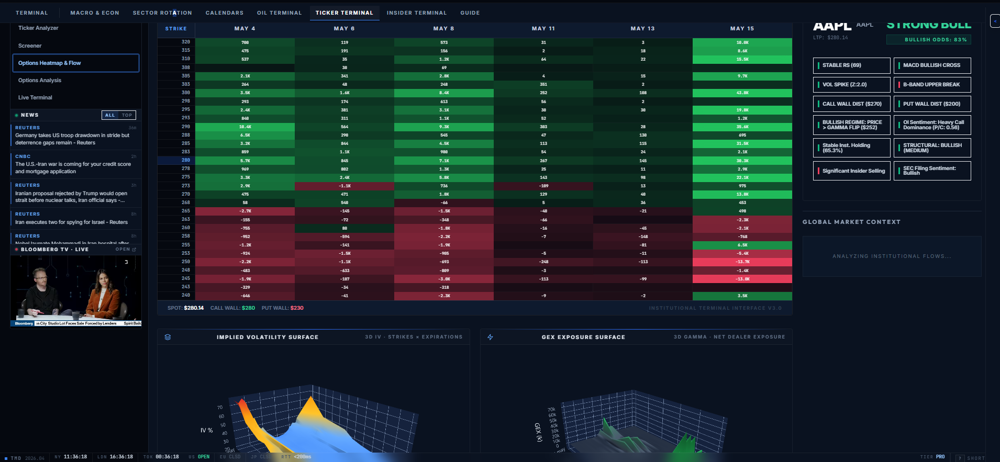

- **Liquidity Surface** — Net Open Interest (Calls minus Puts) heatmap across all strikes and near-term expirations. Toggle between GEX, OI, CHARM, TEX, and Z-SCORE views. Call Wall and Put Wall levels shown below the surface.
- **3D IV Surface** — Implied volatility across strikes and expirations rendered as a 3D surface.
- **3D GEX Surface** — Net dealer gamma exposure across the same strike/expiry grid.
- **Active Ticker Analysis** — Signal dashboard: RS, MACD, vol spike, Bollinger Band signal, call/put wall distances, OI sentiment, institutional holding percentage, structural label, and filing sentiment.
- **Global Market Context** — SPY and QQQ regime snapshot with bullish odds and key signals.

**Options Analysis**

- **Strategy Builder** — Build and price any multi-leg options strategy. Inputs: strike source (live chain or manual), expiration, IV, days to expiration, risk-free rate.
- **P&L Projection** — Today's P&L vs at-expiry across price range. Entry cost, break-even, max profit, max loss, strategy delta.
- **Greek Sensitivities** — Interactive Delta, Gamma, Theta, and Vega chart across the full price range.

**Live Terminal**

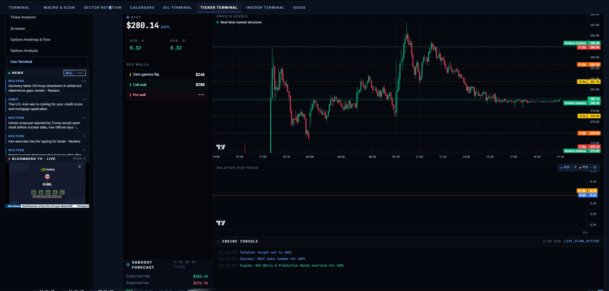

- **Intraday Chart + GEX Walls** — Real-time candlestick with Zero Gamma Flip, Call Wall, and Put Wall as structural overlays. XGBoost forecast shows expected high and low for the session.
- **PCR Stream** — Live put/call ratio trace (PCR-9 and PCR-21) updating on a 15-second tick.
- **Engine Console** — Live log of GEX wall loads, data feeds, and model events as they fire.

---

## Insider Terminal

Institutional research reports, insider trades, and COT positioning. Live insider tape always visible in sidebar.

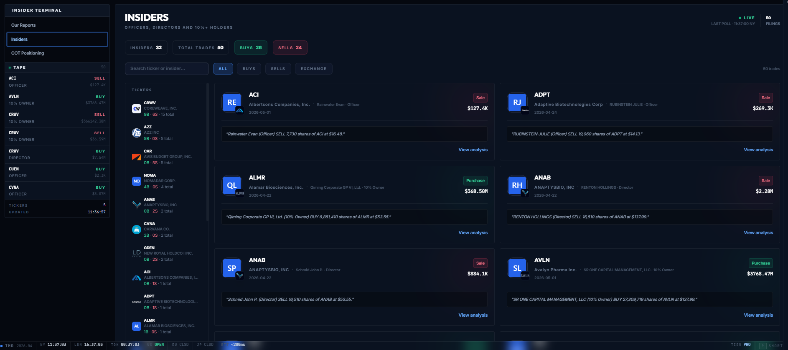

**Our Reports**

Historical library of weekly macro playbooks and situational flash reports. PDF and Excel upload with report thumbnails sorted by date.

**Insiders**

Live feed of stock trades filed by officers, directors, and 10%+ holders. Shows role (Officer / Director / 10% Owner), dollar amount, and transaction description. Aggregated counts of total insiders, total trades, buys, and sells. Search by ticker or insider name, filter by ALL / BUYS / SELLS / EXCHANGE. Ticker sidebar groups all activity by company with buy/sell counts.

**COT Positioning**

Commitment of Traders data ranked by 52-week z-score for NQ, BTC, GC, ES, ZN, DX, and CL. Drill into any instrument for net speculative positioning, z-score, extreme threshold percentage, non-commercial longs/shorts, and a 30-week historical chart.

---

## Pricing

Free tier includes the Macro Dashboard, Sector Rotation, and Calendars. Pro (€29.99/mo) unlocks the Ticker Terminal, Insider Terminal, Oil Terminal, full Seasonals across all asset classes, and the Live Terminal.

3-day free trial on Pro, cancel anytime.

**[Try free at the-macro-dashboard.com](https://the-macro-dashboard.com)**

---

## Stack

React + Vite frontend, FastAPI backend, Supabase (Postgres), Redis. ML layer: FinBERT for financial sentiment analysis, XGBoost for volatility forecasting, PCA for macro regime detection, OpenCV for satellite image processing. Deployed on GCP behind Caddy.

---

Closed-source. For questions: admin@the-macro-dashboard.com
