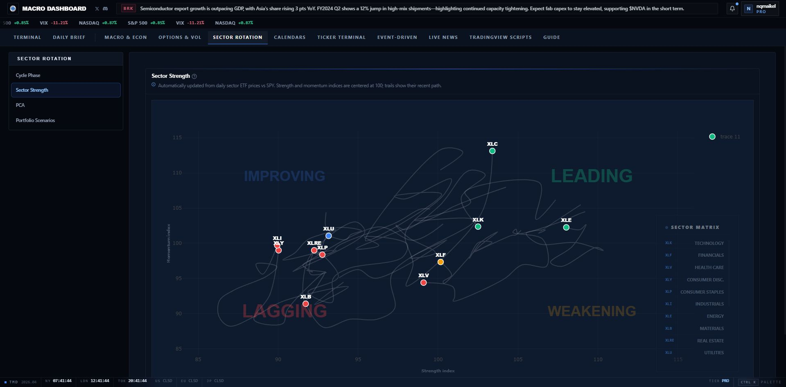
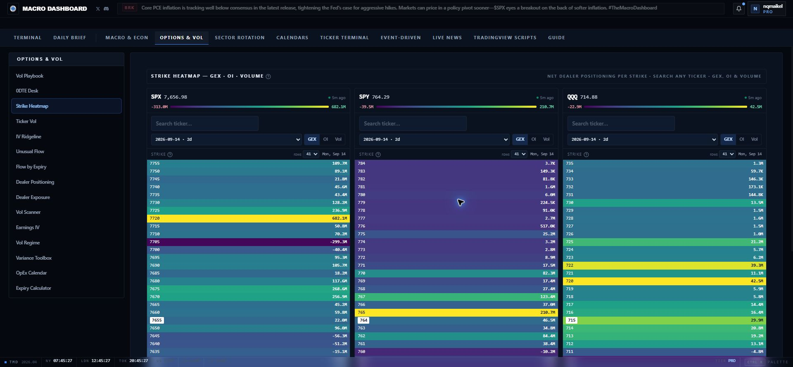
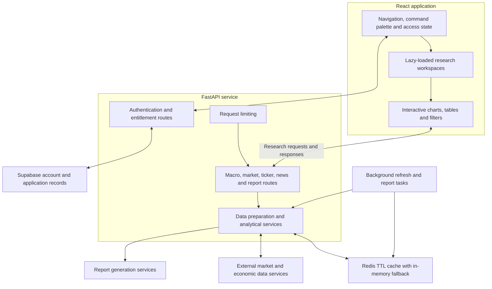
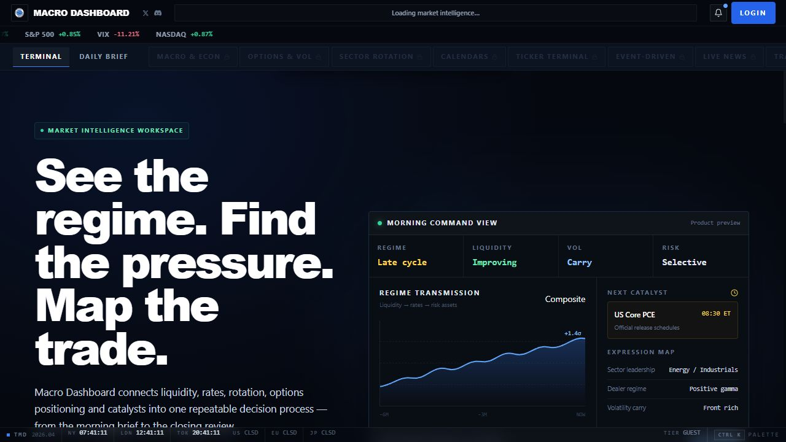

# The Macro Dashboard

### From the market regime to the instrument: a connected research workspace.

An interactive market terminal that brings macro context, options positioning, sector rotation and company research into one navigation system. Move from a broad market question to the chart, expiry or ticker that helps examine it.

**[Explore the live application →](https://the-macro-dashboard.com)**

*The live Sector Rotation workspace, captured on September 12, 2026. The plotted sector paths and controls are part of the actual application.*

## The research workflow

Market research often crosses several different interfaces: economic releases for context, an options chain for positioning, a sector chart for relative strength and company filings for the underlying business. The Macro Dashboard organizes those questions into related workspaces with a shared navigation shell.

A typical session starts with the daily cross-asset brief, moves into macro conditions or sector leadership, and then examines a particular instrument in the options or ticker workspace. Calendars and event-driven views add the dates and catalysts that can change the interpretation. The application supports research and comparison; it does not execute an order from these analytical views.

## Inside the application

| Workspace | What it brings to the research process |
| --- | --- |
| **Daily Brief** | A starting point for the day's cross-asset context and key developments. |
| **Macro & Econ** | Views organized around regimes, liquidity, the yield curve, business-cycle conditions and seasonality. |
| **Options & Vol** | Strike heatmaps, dealer positioning, flow by expiry, implied-volatility views, an earnings-IV view and expiry tools. |
| **Sector Rotation** | Strength and momentum comparisons, sector-cycle views and PCA-oriented analysis. |
| **Calendars** | Economic releases, earnings and options-expiration context alongside the research tools. |
| **Ticker Terminal** | Company and instrument research, including fundamental and filing-oriented views. |
| **Event-Driven** | Dedicated areas for earnings reactions and corporate or scheduled catalysts. |
| **Live News, Scripts & Guide** | News context, TradingView resources and explanations of the workspace. |

## Read positioning at the strike level

The Strike Heatmap puts SPX, SPY and QQQ panels side by side. Each panel has its own ticker field, expiration selector and GEX, open-interest or volume mode. A row-count control changes how many strikes are visible, while the color scale makes concentrations and sign changes easier to locate.

*Actual Options & Vol → Strike Heatmap screen, captured on September 12, 2026. The image preserves the application's displayed market snapshot; it is not a generated interface or a performance result.*

Related views remain accessible in the same sidebar: dealer exposure, unusual flow, flow by expiry, volatility regimes, earnings IV and expiration calculations. That organization lets the researcher examine the same question through several measures without leaving the options workspace.

## Follow sector movement through time

The sector-strength view plots relative position and trailing movement on a shared strength/momentum plane. The path matters as well as the latest point: it shows how the displayed sector relationship has evolved across observations. Sector-cycle and PCA views provide additional ways to inspect the market's internal structure.

The common header keeps the broader workspace available while a specialized chart is open. The inspected frontend also includes a command palette, ticker history, lazy-loaded pages and access checks shared across the application.

## Application architecture

The diagram describes the main boundaries found in the implementation. Analytical screens use a common React application, while a modular Python API organizes data retrieval, analysis, accounts and supporting services.

| Layer | Implementation role |
| --- | --- |
| Frontend | React, Vite and React Router provide the application shell and page navigation. |
| Visualization | Plotly and Recharts support interactive analytical views; Framer Motion supports interface transitions. |
| API | FastAPI separates research, accounts, billing, news and report concerns into route modules. |
| Analysis | Python services prepare datasets and calculate the measures requested by the views. |
| Retrieval and caching | Provider adapters, retry helpers and a TTL cache reduce repeated retrieval work. |
| Persistence | Supabase supports account and application records. |
| Background work | Refresh and report tasks perform work outside individual page-render requests. |

The source review establishes these component boundaries. The screenshots establish the currently deployed interface; local source revisions and the deployed navigation are not assumed to be identical.

## Current product and access

The live application exposes a guest entry and public preview material, with the research workspaces grouped under Pro access. Current availability and subscription details are shown on the [official website](https://the-macro-dashboard.com).

*Actual public entry page, captured on September 12, 2026. Its embedded product preview belongs to the website itself; the analytical screenshots above show the application workspaces directly.*

## About this repository

This repository is the public showcase for The Macro Dashboard: a description of the product, authentic interface captures and an implementation-based architecture diagram. Application source, credentials, account records and operational configuration remain private.

**Last showcase review:** 2026-09-12 (Europe/Paris).
