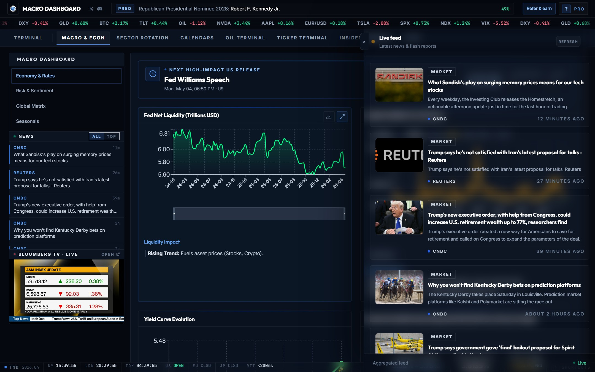
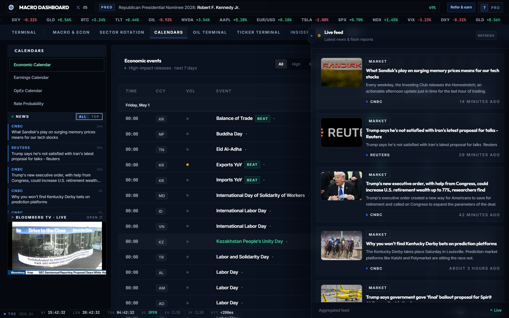
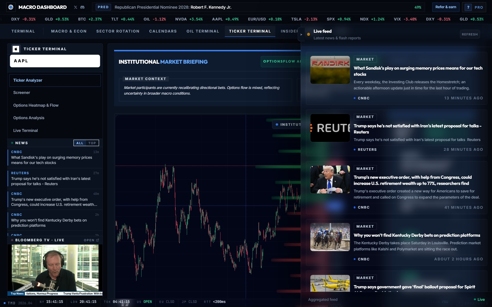
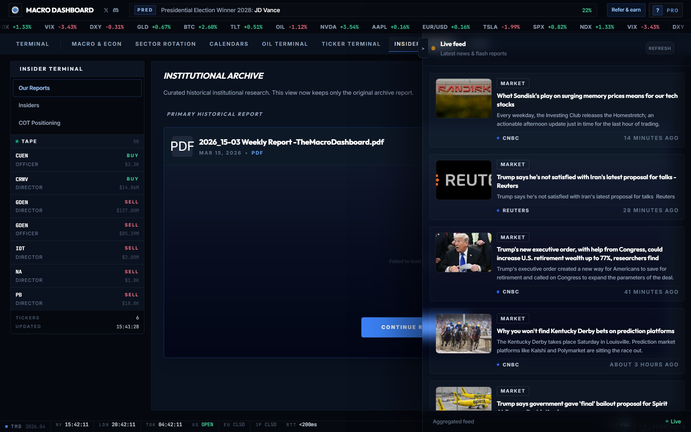

# macro-dashboard

A trading terminal that consolidates macro data, options flow, sector positioning, calendars, and insider activity into one place.

**[Try free at the-macro-dashboard.com](https://the-macro-dashboard.com)**

---

---

## Macro & Econ

Central bank liquidity, yield dynamics, and macro regime intelligence. Four sub-sections: Economy & Rates, Risk & Sentiment, Global Matrix, and Seasonals.

**Economy & Rates**

- **Fed Net Liquidity** — Fed Balance Sheet minus TGA minus RRP. The primary structural driver of risk asset prices. Tracks each component (Fed Balance Sheet, Treasury General Account, Reverse Repo) separately with a net liquidity trend signal.
- **Implied Volatility Term Structure** — IV percentile and historical range across maturities. Detects vol regime shifts before price moves. Displays IV percentile, 52W range, regime label (Normal / Elevated / Stressed), and contango/backwardation status.
- **Yield Curve Evolution** — Full term structure 1M through 30Y with today, 1 month ago, and 1 year ago overlays. Inversion alert included.
- **Fed Funds Risk-Neutral Path (ACM)** — Market-implied rate trajectory from the ACM Term Structure Model. Shows current target range, implied rate, cut/pause/hike probabilities, and next FOMC date.

**Risk & Sentiment**

- **Risk Composite** — Multi-model score (0–100) combining VIX, VVIX, and the Geopolitical Risk Index (GPR) into a single regime signal.
- **Social Search Concern** — NLP-driven Google Trends tracking for fear-based keywords: Recession, Inflation, Mortgage Help. Threshold alert when search volume crosses elevated levels.
- **Corporate Credit Spread (OAS)** — Option-adjusted spread gauge with a semicircle meter. High readings indicate banks are pricing in elevated corporate default risk — a leading bankruptcy indicator.
- **Consumer Sentiment (UMich)** — University of Michigan confidence index with historical chart and trend direction. Leading indicator for consumer spending.

**Global Matrix**

- **Global Economic Indicators** — Interactive cross-country comparison of GDP growth, CPI inflation, and benchmark rates for G10 economies. Toggle between world stats and Eurozone, switch between linear and log scale.

**Seasonals**

- **Seasonal Pattern Charts** — Average realized volatility and price seasonal maps over up to 15 years of history. 5Y / 10Y / 15Y lookback, price mode and volatility mode (21-day rolling standard deviation), covering spot markets, indices, interest rates, bonds, and European markets.

---

## Sector Rotation

Multi-signal sector flow scoring, rotation dynamics, and volatility positioning across all 11 GICS sectors.

**Sector Heatmap**

Per-sector scoring grid updated live. Each sector shows flow probability, RS-SPY, drawdown, RSI, MACD signal, and CMF (accumulation/distribution). Regime classification runs from Strong Bull to Strong Bear. The heatmap also flags structural edge/gap continuation, options flow probability per sector, and relative strength vs SPY.

**Relative Rotation Graph (RRG)**

Scatterplot of 11 sectors mapped across Leading, Weakening, Lagging, and Improving quadrants relative to SPY. Uses JdK RS-Ratio on the x-axis and JdK RS-Momentum on the y-axis with a 12-week rotation trail per sector and a full sector matrix sidebar.

**Stock Battlefield**

2D grid mapping IV Rank against Risk-Reversal to assess volatility cost and directional bias simultaneously. Four quadrants: Cheap/Expensive IV crossed with Bullish/Bearish risk-reversal. Toggle between individual watchlist and sector view.

**PCA**

Principal Component Analysis of sector returns to isolate underlying market factor exposures and co-movement. Shows PC1/PC2 factor loadings, explained variance, and sector clustering.

---

## Calendars

Economic events, earnings, options expiry cycles, and G6 central bank rate path expectations.

**Economic Calendar**

Full macro event calendar for the next 7 days with consensus estimates, prior readings, and a volume/impact column. Filterable by impact level (High / Medium / Low) and currency (USD, EUR, GBP, JPY, CAD, AUD, CHF, NZD). Today-only and full-week toggle.

**Earnings Calendar**

Top earnings reports for the next 5 trading days (Monday through Friday) with beat probability percentage, EPS estimate, and revenue estimate with percentage change. Live sync.

**OpEx Calendar**

Monthly, quarterly, and quad-witching options expiration dates with days remaining and post-OpEx SPY/QQQ price context. Gamma exposure level label per cycle.

**Rate Probability — G6 Central Banks**

Market-implied rate probabilities for Fed, ECB, BOE, BOJ, RBA, and BOC. Shows current target rate, hold/cut/hike bias, probability percentages, next meeting date, and ACM model decomposition separating rate expectations from term premia.

---

## Ticker Terminal

Per-stock institutional intelligence: AI briefing, gamma walls, screener, options flow, strategy builder, and live GEX feed.

**Ticker Analyzer**

- **Institutional Market Briefing** — AI-generated market context and actionable intel summary for the active ticker, built from options positioning and earnings call filings. Includes an OptionsFlow Analysis signal and regime label.
- **Gamma Profile Chart** — Candlestick chart with an institutional gamma profile overlay — horizontal bars at key price levels showing open interest, call/put wall levels, gamma flip level, and OI by strike.
- **Recent News** — AI-tagged news feed for the active ticker with Bullish / Neutral / Bearish sentiment labels per headline.

**Screener**

- **Quick Scan** — Filter the full US equity universe by price, market cap, volume, P/E ratio, and momentum.
- **Value + Options** — Graham/Buffett fundamental filters (P/E, PEG, ROE, margins) combined with IV rank, put/call ratio, and options volume.
- **Results Table** — Sortable output with full market context per match. Save and reload filter presets.

**Options Heatmap & Flow**

- **Liquidity Surface** — Net Open Interest (Calls minus Puts) heatmap across all strikes and near-term expirations. Toggle between GEX, OI, CHARM, TEX, and Z-SCORE views.
- **Active Ticker Analysis** — Full signal dashboard combining RS, MACD, vol spike, Bollinger Band signal, call/put wall distances, OI sentiment, institutional holding percentage, structural label, and SEC filing sentiment.
- **Global Market Context** — Side-by-side regime snapshot for SPY and QQQ with bullish odds percentage and key signals.

**Options Analysis**

- **Strategy Builder** — Build and price any multi-leg options strategy. Inputs: strike source (live chain or manual), expiration date, IV percentage, days to expiration, risk-free rate.
- **P&L Projection** — Today's P&L vs at-expiry across a price range. Shows entry cost, break-even, max profit, max loss, and strategy delta.
- **Greek Sensitivities** — Interactive chart of Delta, Gamma, Theta, and Vega across the full price range.

**Live Terminal**

- **Intraday Chart + GEX Walls** — Real-time candlestick with Zero Gamma Flip, Call Wall, and Put Wall drawn as structural overlays.
- **PCR Stream** — Live put/call ratio trace updating every few seconds. SPY and QQQ toggle with PCR-9, PCR-21, and relative PCR trace chart.
- **Logs Feed** — Live feed of significant options prints and GEX events as they hit the tape. Toggle on/off.

---

## Insider Terminal

Institutional research reports, SEC insider trades, and COT positioning. Live insider tape always visible in sidebar.

**Our Reports**

Historical library of weekly macro playbooks and situational flash reports. PDF and Excel upload with report thumbnails sorted by date. Weekly report upload and situational alert upload are separate dropzones.

**Insiders**

- **Live SEC Form 4 Feed** — Real-time feed of stock trades filed by officers, directors, and 10%+ holders, sourced directly from SEC Form 4. Shows role (Officer / Director / 10% Owner), dollar amount, transaction description, total insider count, trade count, buys, and sells.
- **Ticker Sidebar** — Active tickers grouped by company with buy/sell counts. Search by ticker or insider name, filter by ALL / BUYS / SELLS / EXCHANGE.

**COT Positioning**

- **Positioning Tape** — CFTC Commitment of Traders data ranked by 52-week z-score for NQ, BTC, GC, ES, ZN, DX, and CL.
- **Instrument Drill-Down** — Detailed positioning view for any selected instrument: net speculative positioning in contracts, 52W z-score, extreme threshold percentage, non-commercial longs/shorts, and a 30-week historical chart.

---

## Oil Terminal

Institutional crude oil terminal. Left sidebar shows live synthesis, Cushing inventory, tanker count, and risk-bias signal at all times.

**Flow Spreads**

Real-time Brent and WTI prices with 6-month spread history. Current spread, 30-day average, 6-month min/max, standard deviation, and delta vs 30-day average. The synthesis sidebar surfaces a directional signal (Bullish / Bearish), Cushing utilization percentage, VLCC tanker count, floating storage level, and a risk-bias score from 0 to 100.

**Macro Matrix**

Rolling correlation heatmap between crude, energy equities, natural gas, and the USD — covering BZ=F, CL=F, NG=F, XLE, XOM, CVX, OXY, SLB, HAL, UNG, USO, and DX-Y. Adjustable lookback window with strongest and weakest/inverse coupling lists.

**Vessel Intelligence**

- **Live Tanker Map** — Real-time global tanker positions via AIS data. Click any vessel for MMSI, status, load factor, speed, and destination. Fleet load and transit activity (High / Normal / Low) displayed as aggregate metrics. Chokepoint congestion alerts for Hormuz, Suez, and Bab-el-Mandeb.
- **Global Flow Intel** — Fleet metrics and composition breakdown: Transit Index in MBBL on water, fleet utilization percentage, and fleet split across VLCC, Suezmax, Aframax, Panamax, MR, and small tankers.

---

## Pricing

Free tier includes the Macro Dashboard, Sector Rotation, and Calendars. Pro (€29.99/mo) unlocks the Ticker Terminal, Insider Terminal, Oil Terminal, full Seasonals across all asset classes, and the Live Terminal.

3-day free trial on Pro, cancel anytime.

**[Try free at the-macro-dashboard.com](https://the-macro-dashboard.com)**

---

## Stack

React + Vite frontend, FastAPI backend, Supabase (Postgres), Redis. ML layer: FinBERT for sentiment analysis on SEC filings and earnings calls, XGBoost for volatility forecasting, PCA for macro regime detection, OpenCV for satellite image processing. Deployed on GCP behind Caddy.

---

Closed-source. For questions: admin@the-macro-dashboard.com
