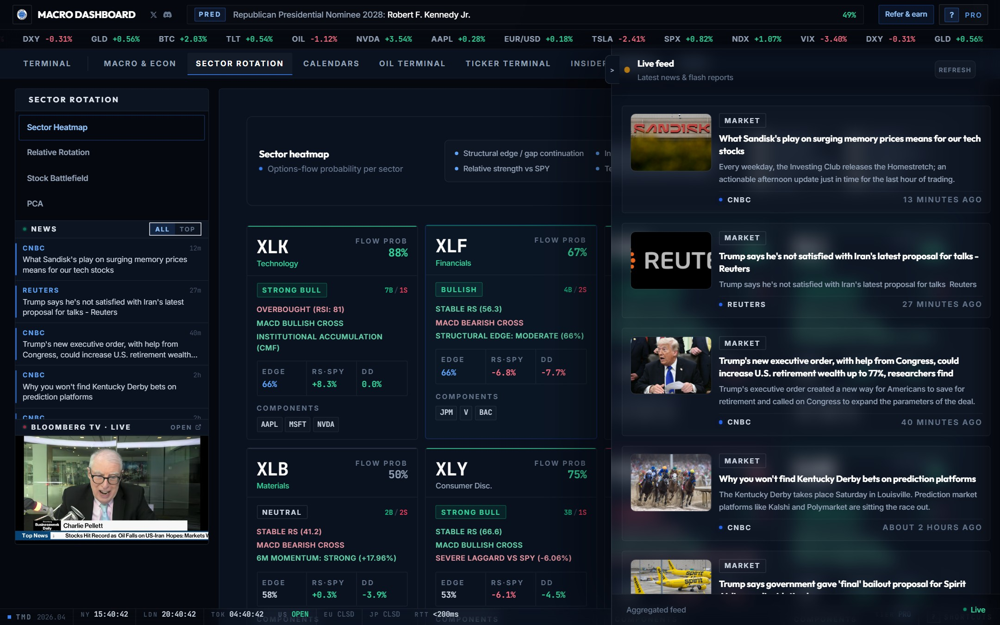
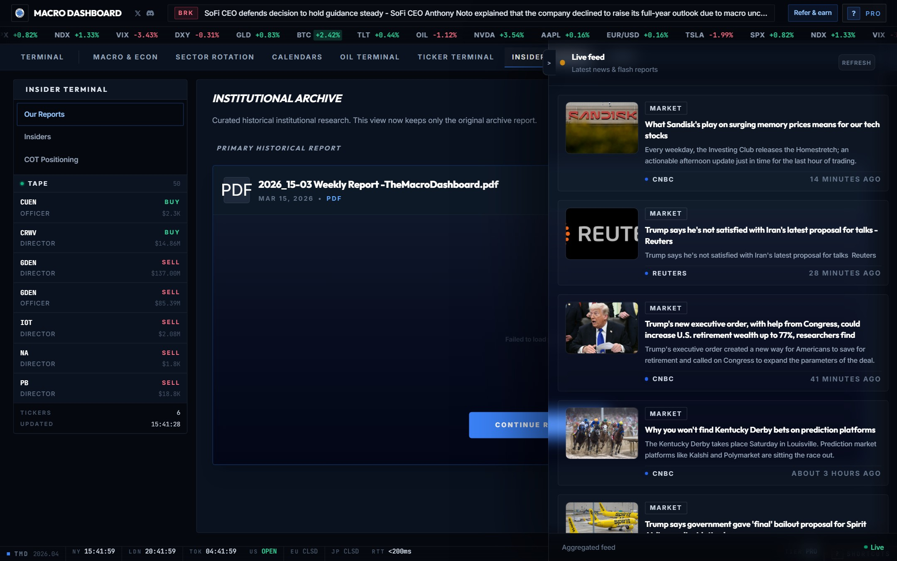

# macro-dashboard

A trading terminal that consolidates macro data, options flow, sector positioning, and insider activity into one place. Built because tracking all of this across separate tabs was slowing down the actual analysis.

Live at **[the-macro-dashboard.com](https://the-macro-dashboard.com)**.

---

The main view surfaces Fed net liquidity, yield curve evolution, M2, GDP nowcast, and a live news feed with Bloomberg TV — all on one screen. A countdown to the next high-impact release sits at the top so you always know what's coming before the market moves.

---

## Modules

**Macro & Econ**

Economy & Rates, Risk & Sentiment, Global Matrix, and Seasonals all live here. The liquidity panel tracks RRP, TGA, and SOMA separately so you can see where the Fed is actually pulling from. Shadow rate and cross-asset correlation fill in what the headline numbers miss.

**Sector Rotation**

Each sector gets a flow probability score, relative strength vs SPY, options-derived directional bias, delta deviation, and RS-SPY momentum — all updated live. You can see at a glance which sectors have institutional accumulation signals and which are lagging. Includes a Stock Battlefield overlay and PCA-based regime detection.

**Calendars**

Economic and earnings calendars with consensus estimates, prior readings, and a historical deviation score for each event. FOMC, CPI, NFP, PCE ranked by their actual impact on price — not just their label.

**Ticker Terminal**

Enter any symbol and get an institutional market briefing: market context summary, options flow activity, heatmap, full options chain analysis, and a live terminal with Shannon Bands and dealer positioning. The briefing is built from options positioning and earnings call filings, not news headlines.

**Insider Terminal**

Live Form 4 tape — corporate directors and officers, transaction sizes, buy/sell tags updating in real time. Alongside that, a weekly curated research report covering the most significant institutional moves of the week, plus situational flash reports when something notable happens mid-week. COT positioning is also here.

**Oil Terminal**

Cushing storage levels derived from satellite imagery processed on the fly, tanker fleet tracking via live AIS feeds, and chokepoint monitoring across Hormuz, Suez, and Bab-el-Mandeb. Brent tends to react before the weekly inventory reports — this is where you watch for early signals.

---

## Pricing

Free tier covers the macro panel, sector rotation, and calendars. Pro (€29.99/mo) unlocks the Ticker Terminal, Insider Terminal, Oil Terminal, full seasonality across all asset classes, and the live terminal.

3-day free trial on Pro, cancel anytime.

---

## Stack

React + Vite frontend, FastAPI backend, Supabase (Postgres), Redis. ML layer covers FinBERT for sentiment analysis on SEC filings, XGBoost for volatility forecasting, PCA for macro regime detection, and OpenCV for satellite image processing. Deployed on GCP behind Caddy.

---

Closed-source. For questions: admin@the-macro-dashboard.com
